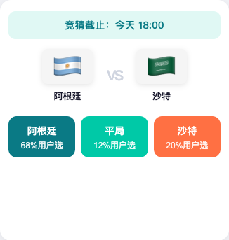
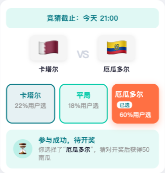
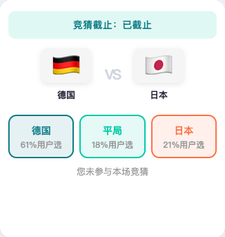
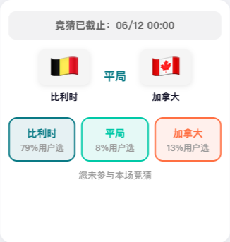
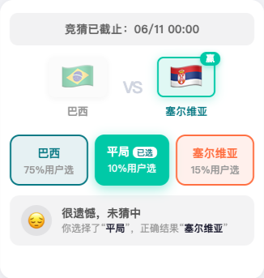
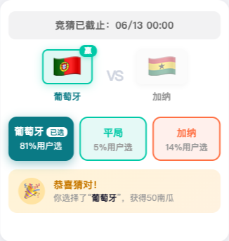

# 赛事板块 · 6 种状态 UI 对照截图说明

> 基于原型：`worldcup-predictor.html`  
> 截图目录：`docs/screenshots/`  
> 生成方式：运行 `node capture-6-states.mjs`（需本地 `8123` 端口 HTTP 服务）

---

## 总览

赛事卡片由 **赛事状态**（`open` / `locked` / `ended`）与 **用户参与状态**（未参与 / 已参与）组合，共形成 6 种典型 UI 态。下表为对照索引：

| # | 状态名称 | match id | 对阵 | 轮播 index | 截图 |
|---|----------|----------|------|------------|------|
| 1 | 待开奖 · 未参与 · 可竞猜 | m3 | 阿根廷 vs 沙特 | 0 | [卡片](./screenshots/01-待开奖-未参与-可竞猜-卡片.png) / [全屏](./screenshots/01-待开奖-未参与-可竞猜-全屏.png) |
| 2 | 待开奖 · 已参与 | m1 | 卡塔尔 vs 厄瓜多尔 | 1 | [卡片](./screenshots/02-待开奖-已参与-卡片.png) / [全屏](./screenshots/02-待开奖-已参与-全屏.png) |
| 3 | 已锁盘 · 未参与 | m4 | 德国 vs 日本 | 2 | [卡片](./screenshots/03-已锁盘-未参与-卡片.png) / [全屏](./screenshots/03-已锁盘-未参与-全屏.png) |
| 4 | 已开奖 · 未参与 · 平局 | m5 | 比利时 vs 加拿大 | 3 | [卡片](./screenshots/04-已开奖-未参与-平局-卡片.png) / [全屏](./screenshots/04-已开奖-未参与-平局-全屏.png) |
| 5 | 已开奖 · 已参与 · 未猜中 | m6 | 巴西 vs 塞尔维亚 | 4 | [卡片](./screenshots/05-已开奖-已参与-未猜中-卡片.png) / [全屏](./screenshots/05-已开奖-已参与-未猜中-全屏.png) |
| 6 | 已开奖 · 已参与 · 猜中 | m2 | 葡萄牙 vs 加纳 | 5 | [卡片](./screenshots/06-已开奖-已参与-猜中-卡片.png) / [全屏](./screenshots/06-已开奖-已参与-猜中-全屏.png) |

---

## 状态 1：待开奖 · 未参与 · 可竞猜

**触发条件**：`status = open`，用户未投票（`state.votes` 无该 match id）

### 区域说明

| 区域 | 样式 | 内容 | 交互 |
|------|------|------|------|
| 截止条 | 青绿浅底 `.mc-deadline` | `竞猜截止：今天 18:00` | 无 |
| 对阵区 | 双方国旗 + VS | 阿根廷 🇦🇷 vs 沙特 🇸🇦 | 无 |
| 选项区 | 三个**实心**按钮 | 阿根廷 68% / 平局 12% / 沙特 20% | **可点击**，提交竞猜 |
| 状态条 | 不展示 | — | — |
| 底部提示 | 不展示 | — | — |

### 按钮配色

- 阿根廷（A）：深青绿 `#0A7A85`
- 平局（D）：主色青绿 `#00C9A7`
- 沙特（B）：暖橙红 `#FF7043`

### 用户操作

点击任一选项 → 写入 `state.votes` → 卡片刷新为状态 2 → 弹出「参与成功，待开奖」弹窗。

---

## 状态 2：待开奖 · 已参与

**触发条件**：`status = open`，用户已投票（本例 `pick = B`，选沙特）

### 区域说明

| 区域 | 样式 | 内容 |
|------|------|------|
| 截止条 | 青绿浅底 | `竞猜截止：今天 21:00` |
| 对阵区 | 标准 VS | 卡塔尔 vs 厄瓜多尔 |
| 选项区 | 已选实心 + 未选描边 | 厄瓜多尔「**已选**」高亮；其余为 revealed 态 |
| 状态条 | 青绿浅底 `.result-status.pending` | ⏳ **参与成功，待开奖** |
| 状态描述 | — | 你选择了「厄瓜多尔」，猜对开奖后获得50南瓜 |

### 关键差异（对比状态 1）

- 选项由 `<button>` 变为不可点的 `
`
- 所选选项带白色「已选」标签 `.vpb-tag`
- 新增待开奖状态条，**不可修改预测**

---

## 状态 3：已锁盘 · 未参与

**触发条件**：`status = locked`，用户未投票

### 区域说明

| 区域 | 样式 | 内容 |
|------|------|------|
| 截止条 | 青绿浅底（文案变「已截止」） | `竞猜截止：已截止` |
| 对阵区 | 标准 VS | 德国 vs 日本 |
| 选项区 | 全部 revealed 描边态 | 三选项均不可点，仅展示支持率 |
| 状态条 | 不展示 | — |
| 底部提示 | 灰色居中 `.not-voted-hint` | **您未参与本场竞猜** |

### 关键差异

- 锁盘后未参与用户**无法再投票**
- 无个人状态条，仅底部未参与文案

---

## 状态 4：已开奖 · 未参与 · 平局

**触发条件**：`status = ended`，`result = D`（平局），用户未投票

### 区域说明

| 区域 | 样式 | 内容 |
|------|------|------|
| 截止条 | 灰色浅底 `.mc-deadline.ended` | `竞猜已截止：06/12 00:00` |
| 对阵区 | 中间显示「**平局**」`.tv-vs.draw` | 比利时 vs 加拿大，双方无胜负高亮 |
| 选项区 | 全部 revealed 描边态 | 比利时 79% / 平局 8% / 加拿大 13% |
| 状态条 | 不展示 | — |
| 底部提示 | 灰色居中 | **您未参与本场竞猜** |

### 平局特殊规则

- `result === 'D'` 时，VS 区中间文案由 `VS` 替换为 `平局`
- 双方国旗**不加**「赢」角标，也不做 winner/loser 样式

---

## 状态 5：已开奖 · 已参与 · 未猜中

**触发条件**：`status = ended`，用户 `pick = D`（平局），实际 `result = B`（塞尔维亚胜）

### 区域说明

| 区域 | 样式 | 内容 |
|------|------|------|
| 截止条 | 灰色浅底 | `竞猜已截止：06/11 00:00` |
| 对阵区 | 胜方高亮 + 负方淡化 | 塞尔维亚「赢」角标；巴西淡化 |
| 选项区 | 已选「平局」描边高亮 | 用户选 D，结果 B |
| 状态条 | 灰色浅底 `.result-status.lose` | 😔 **很遗憾，未猜中** |
| 状态描述 | — | 你选择了「平局」，正确结果「塞尔维亚」 |

### 对阵区样式

| 角色 | class | 视觉 |
|------|-------|------|
| 胜方 | `.tv-team.winner` | 青绿边框 + 「赢」角标 + 队名加粗 |
| 负方 | `.tv-team.loser` | 国旗 opacity 45%，队名灰色 |

---

## 状态 6：已开奖 · 已参与 · 猜中

**触发条件**：`status = ended`，用户 `pick = A`，实际 `result = A`（葡萄牙胜）

### 区域说明

| 区域 | 样式 | 内容 |
|------|------|------|
| 截止条 | 灰色浅底 | `竞猜已截止：06/13 00:00` |
| 对阵区 | 葡萄牙胜方高亮 | 葡萄牙「赢」角标；加纳淡化 |
| 选项区 | 葡萄牙「**已选**」实心高亮 | 81% / 5% / 14% |
| 状态条 | 金色渐变 `.result-status.win` | 🎉 **恭喜猜对！** |
| 状态描述 | — | 你选择了「葡萄牙」，获得50南瓜 |

### 关键差异（对比状态 5）

- 状态条背景为金色渐变（猜中奖励感）
- 标题色 `#C77800`（暖金色）
- 描述强调获得南瓜值奖励

---

## 六态横向对比

### 截止条

| 状态 | 背景色 | 文案前缀 |
|------|--------|----------|
| 1、2、3 | 青绿浅底 | `竞猜截止：` |
| 4、5、6 | 灰色浅底 | `竞猜已截止：` |

### 选项区交互形态

| 状态 | 按钮类型 | 可点击 |
|------|----------|--------|
| 1 | 实心 button | ✅ |
| 2～6 | revealed / selected div | ❌ |

### 底部区域

| 状态 | 状态条 | 底部提示 |
|------|--------|----------|
| 1 | 无 | 无 |
| 2 | 待开奖 ⏳ | 无 |
| 3 | 无 | 未参与 |
| 4 | 无 | 未参与 |
| 5 | 未猜中 😔 | 无 |
| 6 | 猜中 🎉 | 无 |

---

## 轮播上下文（全屏截图）

每张「全屏」截图包含赛事板块在页面中的实际上下文：参与播报跑马灯 + 当前赛事卡片 + 左侧 peek 露出相邻卡片。

| 状态 | 全屏截图 | 左侧 peek 露出 |
|------|----------|----------------|
| 1 | [全屏](./screenshots/01-待开奖-未参与-可竞猜-全屏.png) | 卡塔尔场次（状态 2） |
| 2 | [全屏](./screenshots/02-待开奖-已参与-全屏.png) | 德国场次（状态 3） |
| 3 | [全屏](./screenshots/03-已锁盘-未参与-全屏.png) | 比利时场次（状态 4） |
| 4 | [全屏](./screenshots/04-已开奖-未参与-平局-全屏.png) | 巴西场次（状态 5） |
| 5 | [全屏](./screenshots/05-已开奖-已参与-未猜中-全屏.png) | 葡萄牙场次（状态 6） |
| 6 | [全屏](./screenshots/06-已开奖-已参与-猜中-全屏.png) | 无（末张） |

---

## 验收对照清单

开发/测试可按以下清单逐态核对：

- [ ] **状态 1**：三按钮实心可点，无状态条，截止条为青绿底
- [ ] **状态 2**：已选选项带「已选」标签，待开奖状态条文案正确
- [ ] **状态 3**：截止文案「已截止」，底部「您未参与本场竞猜」
- [ ] **状态 4**：VS 区显示「平局」，双方无 winner 样式
- [ ] **状态 5**：胜方「赢」角标，未猜中状态条含正确结果名
- [ ] **状态 6**：猜中金色状态条，奖励文案「获得50南瓜」
- [ ] 六态切换：左右滑动轮播 index 0～5 均可到达
- [ ] 非当前卡片 peek 态：opacity 60%、scale 96%

---

## 相关文件

| 文件 | 说明 |
|------|------|
| `worldcup-predictor.html` | 原型页面 |
| `docs/赛事板块-PRD.md` | 完整产品需求文档 |
| `capture-6-states.mjs` | 6 态截图自动生成脚本 |
| `docs/screenshots/*.png` | 截图资源（卡片 + 全屏各 6 张） |
